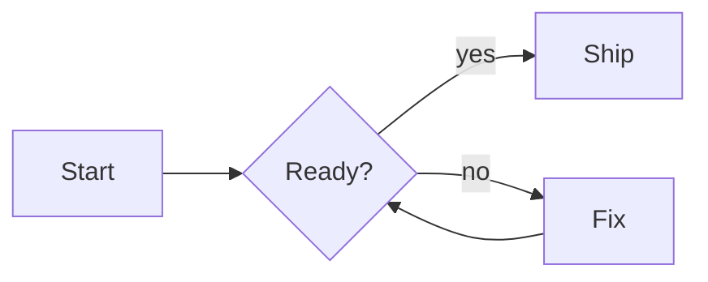
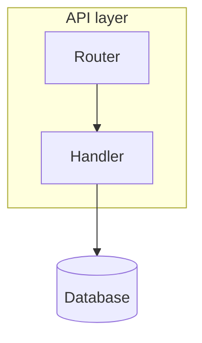
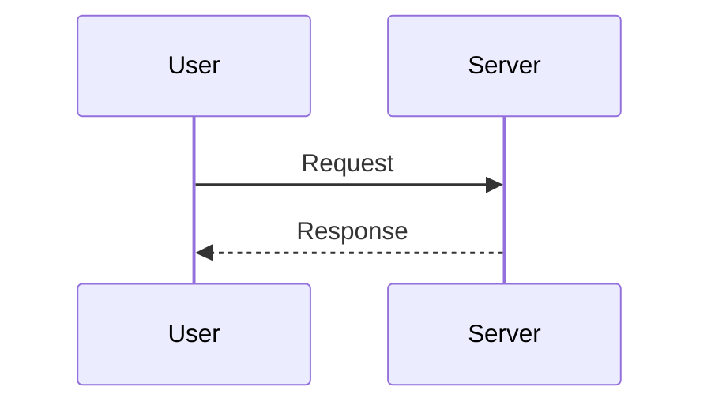
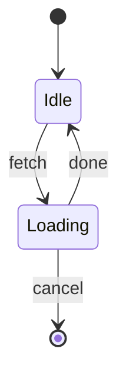
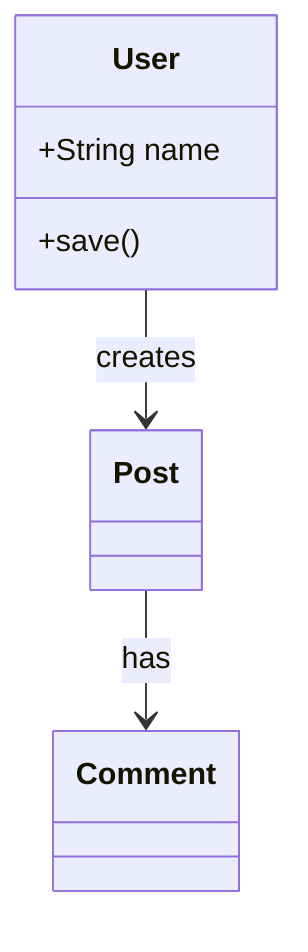
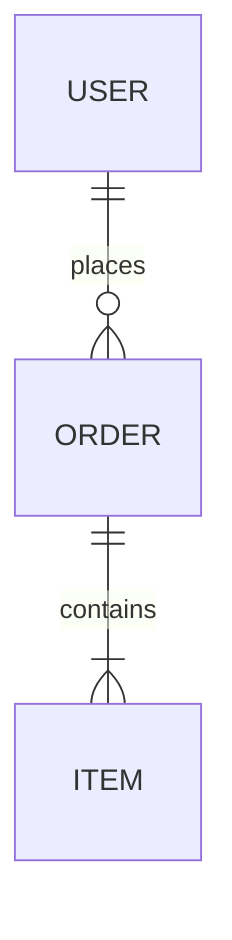
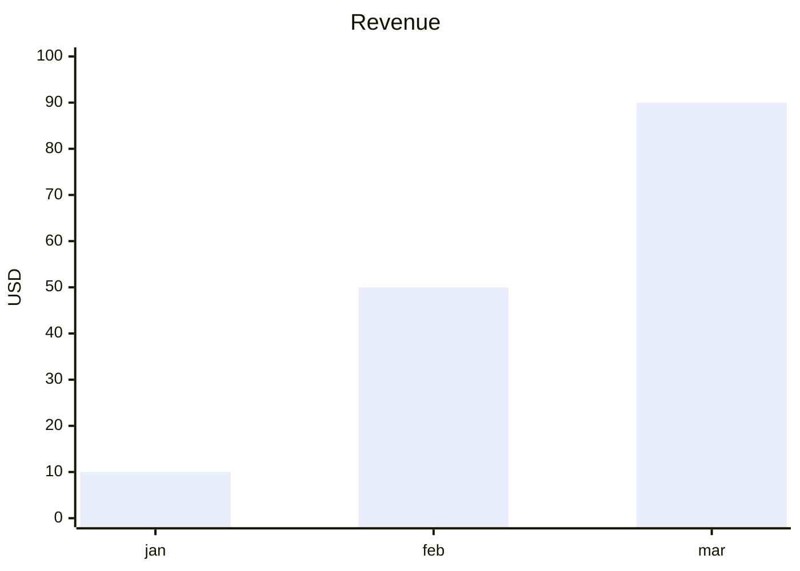
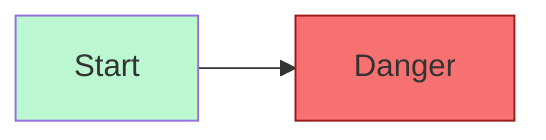

# Diagram types

The beautiful-mermaid library reads a subset of the Mermaid language. This file lists the
types that the library renders, and the types that it refuses. Each example is tested against
version 1.1.3.

## Types that render

| Header | Use it for |
| --- | --- |
| `flowchart <dir>` or `graph <dir>` | A process, a workflow, or a decision tree |
| `sequenceDiagram` | An exchange of messages between parts |
| `stateDiagram-v2` | A lifecycle, or a state machine |
| `classDiagram` | An object model, or the parts of a system |
| `erDiagram` | A database schema |
| `xychart-beta` | A bar chart or a line chart |

The direction `<dir>` is `TD`, `TB`, `LR`, `BT`, or `RL`.

## Types that the library refuses

`mindmap`, `pie`, `gantt`, `journey`, `gitGraph`, `timeline`, `quadrantChart`, and
`C4Context` all fail. The error names the headers that the library accepts:

```
Invalid mermaid header: "pie title Pets". Expected "graph TD", "flowchart LR", ...
```

Choose a different type, or render that diagram with another tool.

## Examples

### Flowchart



Node shapes: `A[box]`, `A(rounded)`, `A([stadium])`, `A{diamond}`, `A((circle))`,
`A[[subroutine]]`, `A[(cylinder)]`, `A{{hexagon}}`.

Edges: `-->` solid, `-.->` dotted, `==>` thick. Add a label with `-->|text|`.

Groups:



### Sequence



Declare each participant. A body with no `participant` line can render to 0 x 0.

### State



### Class



### Entity relationship



Cardinality: `||` one, `o{` zero or more, `|{` one or more.

### Chart



## Styling in the source

The library reads `classDef`, `class`, `:::`, `style`, and `linkStyle`. These override the
theme for the nodes and the edges that they name.



## Which type to choose

- A step follows a step, and a step can branch — **flowchart**.
- Two or more parts send messages in an order — **sequence**.
- One thing moves between named conditions — **state**.
- You show the parts of a system and what they hold — **class**.
- You show tables and their relations — **entity relationship**.
- You compare numbers — **chart**.

If two types fit, choose the flowchart. It is the type that most readers know.
